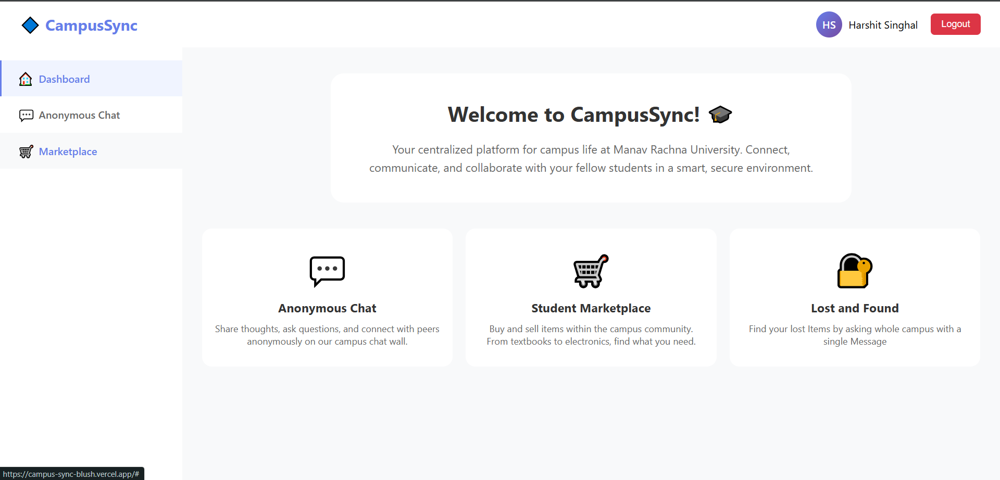

# CampusSync - Campus Community Platform 🎓

**Version 1.0** | *Connecting Campus Life Digitally*



## 🌟 Project Overview
CampusSync is a comprehensive web platform designed to bridge the gap between students and campus resources. This V1 release establishes the foundation for digital campus community building through modern web technologies.

### Key Features
- 🏫 Centralized campus information hub
- 📅 Interactive event calendar
- 📚 Digital resource repository
- 👥 Student community portal
- 🔔 Real-time notifications system
- 📱 Responsive mobile-first design

## 🛠️ Technology Stack
**Core Architecture:**
- **Frontend:** 
  - HTML5 Semantic Markup
  - CSS3 (Flexbox/Grid layouts)
  - Vanilla JavaScript (ES6+)
- **Backend:** 
  - Firebase Realtime Database
  - Firebase Authentication
  - Firebase Hosting

## 🚀 Getting Started
### Prerequisites
- Modern web browser (Chrome 80+ recommended)
- Node.js v16.14+
- Firebase CLI tools

### Installation
```bash
# Clone repository
git clone https://github.com/harshitsinghal11/CampusSync.git

# Install dependencies
npm install firebase @firebase/app @firebase/database

# Start development server
firebase serve
```

## 📈 Future Roadmap
- **V1.1:** User authentication system
- **V2.0:** Social features implementation
- **V3.0:** Mobile app integration

## 🤝 Contribution Guidelines
We welcome contributions!

## 📜 License
*License information pending - Currently in private development phase*

---
*Developed with ❤️ by Harshit Singhal | Last Updated: October 2025*
